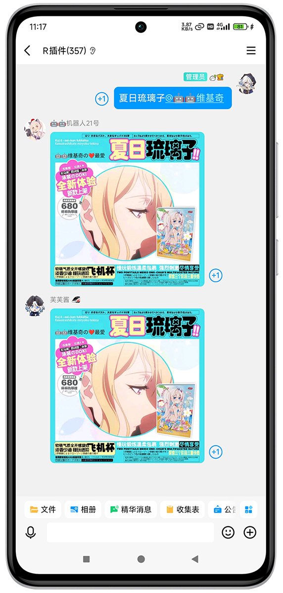
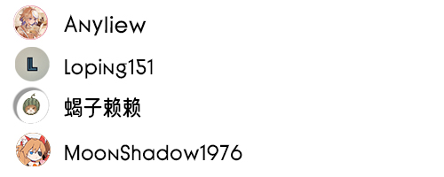

<div align="center">


# meme_emoji 

<p align="center">
  
  
  <a href="https://pypi.org/project/meme-generator">
    
  </a>
</p>
</div>

## meme_emoji 表情包扩展仓库 

*🚀* 基于 [meme-generator](https://github.com/MemeCrafters/meme-generator) 做的表情包扩展仓库~

*✨* 为你的聊天机器人添加更多趣味表情生成！

> [!NOTE]
>
> 请注意，本仓库的内容仅支持以下特定版本的依赖库：
>
> - `meme_generator == 0.1.14`（最高兼容版本）
> - `nonebot-plugin-memes == 0.7.12`（最高兼容版本）
>
> 为确保功能正常运行，请勿使用高于指定版本的依赖库。
>
> 若您已安装更高版本，建议使用以下命令进行版本调整：
>
> ```
> pip install meme_generator==0.1.14
> ```
>
> Nonebot用户请使用：
> ```
> pip install nonebot-plugin-memes==0.7.12 && pip install meme_generator==0.1.14
> ```
> Nonebot的目录下pyproject.toml文件新增添加：
> ```
> plugins = ["nonebot_plugin_memes"]
> ```
> 

## ✨特性

- ✅ **海量表情** 偶尔做做热门表情包，也欢迎投稿高清有趣的素材
- ⚡ **实时生成** 支持通过指令快速生成表情
- 🔄 **搭配使用** 需要搭配 [meme-generator](https://github.com/MemeCrafters/meme-generator) 一起使用

- ✨**搭配演示架构图所示(仅供参考)：**


## 🤠 表情示例


### 🖼 参考预览图：

<details><summary>🖼点击展开 预览图 "夏日琉璃子"</summary><p>
<a></a>
</details>


### 😀 表情列表清单

#### 😉 名称排序  A-Z

* [表情列表](https://github.com/anyliew/meme_emoji/wiki/%E8%A1%A8%E6%83%85%E5%88%97%E8%A1%A8)

#### 🥰 时间排序  新-旧

* [表情列表](https://github.com/anyliew/meme_emoji/blob/main/docs/meme_emoji_keywords.md)


## 📄 使用教程 

- [meme_emoji wiki](https://github.com/anyliew/meme_emoji/wiki) 


## ⚖ 许可证

延续(copy) meme-generator 作者  MeetWq MIT 许可证 

> MIT License https://github.com/MemeCrafters/meme-generator/blob/main/LICENSE
> 
> MIT License https://github.com/anyliew/meme_emoji/blob/main/LICENSE
> 
>chat.deepseek https://github.com/anyliew/meme_emoji/raw/main/docs/picture/chat.deepseek.png)


## 💐 鸣谢

感谢以下开发者对 meme_emoji 仓库作出的贡献

<a href="https://github.com/anyliew/meme_emoji/graphs/contributors">
  
</a>

## 📝 反馈

### 🤔 issues

> issues https://github.com/anyliew/meme_emoji/issues 

单个表情有问题反馈请附带日志和截图
答复受限网络没那么快及时处理

## 🥳 投稿

> 🚧欢迎投稿高清素材，看到一些有趣的素材图片会制作成表情更新到本仓库！
>
> 通过issues中的模板 “投稿素材” 进行投稿，如果能Pr则更加完美，实在是泰裤辣~

## 🔗 相关链接

### meme-generator
- [meme-generator](https://github.com/MemeCrafters/meme-generator) 

### wiki 文档
- [meme-generator wiki](https://github.com/MemeCrafters/meme-generator/wiki)
- [meme_emoji wiki](https://github.com/anyliew/meme_emoji/wiki)

### 额外表情仓库

- [meme-generator-contrib](https://github.com/MemeCrafters/meme-generator-contrib) 
- [meme_emoji](https://github.com/anyliew/meme_emoji) 
- [meme-generator-jj](https://github.com/jinjiao007/meme-generator-jj) 


## 📌 免责声明

本仓库的表情素材等均来自网络
如有侵权请通过issues联系作者删除
